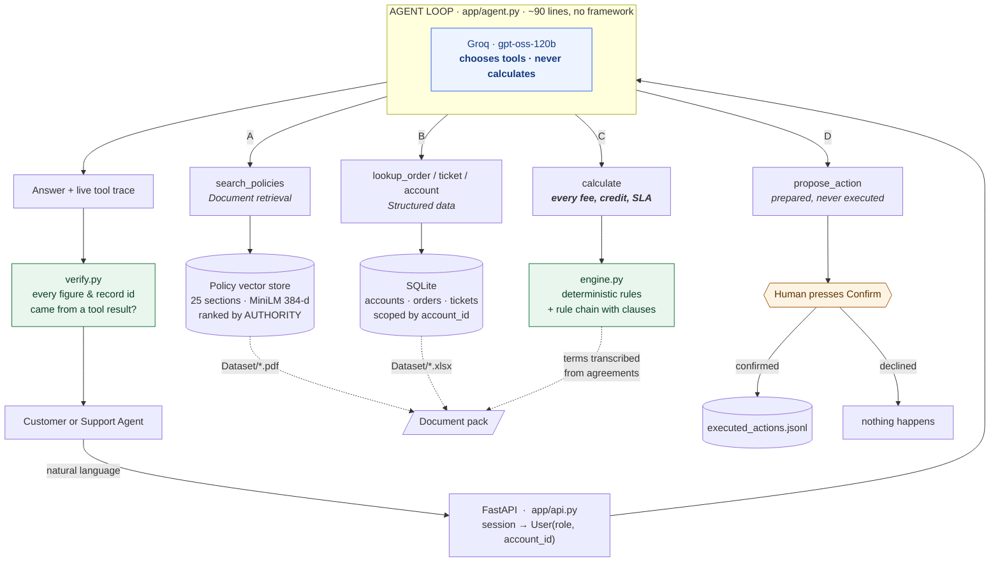

# ParcelPilot Support Intelligence

A support assistant for a logistics platform, built so that **every number it
states can be traced to a clause in a document and reproduced by a unit test.**

There are two users. A **customer** gets a plain answer about their own account.
A **support agent** gets the same answer plus the working behind it — the rule
chain, the clause at each step, and the sources that were considered and
rejected.

---

## The one idea

Most LLM assistants let the model look things up and then do arithmetic in its
own head. That produces answers nobody can defend: ask *why INR 250?* and the
honest reply is "because it sampled that."

Here the work is split so the model never holds a number it did not receive:

> **The model decides which tools to call. The tools decide what the answer is.**

The agent picks `calculate(kind='cancellation', order_id='ORD-1001')`. The
engine returns **INR 0** together with the clause that made it zero. Asking a
model to route is safe. Asking it to do arithmetic is not.



**Read the colours:** blue is the only non-deterministic box. Green is where
every number comes from and where it is checked on the way out. Amber is the
only path to a state change, and no model can reach it.

The consequences are the reason to build it this way:

| | |
|---|---|
| **A wrong figure is a bug** | Reproducible, fixable, covered by a test — not an unlucky sample. |
| **The explanation is real** | *Why INR 0?* replays `decision.rule_chain`, which names the clause at each step. Not the model reconstructing its reasoning afterwards. |
| **It survives the model** | If the API is down, whatever `calculate` already returned is still correct, and the product shows it rather than apologising. |
| **50 tests, no API key** | The entire decision layer, the tool layer and the confirmation gate are testable offline. |

### Meeting the brief

| Requirement | Where |
|---|---|
| ≥3 distinct tools the agent chooses between | `app/tools.py` — four categories (retrieval, structured data, calculation, action) |
| Access control in the data/tool layer, not the prompt | `app/records.py` scopes every read; `tools.available()` withholds capabilities a role may not use |
| Confirmation before state changes | `app/actions.py` — the model has no tool that can commit; a person calls `/confirm` |
| Multi-step requests | The loop runs up to six steps: look up the order → find the account → read the agreement → calculate → propose |
| Interface shows which tool is used | Live trace above each answer — tool names for staff, plain language for customers |

## What it gets right

The dataset is small and full of traps. These are the ones that matter:

**A signed contract beats the policy.** ORD-1001 was cancelled 120 minutes after
booking, so the SOP says INR 250 — and ticket TKT-450 shows an agent telling
Northstar exactly that. The Northstar agreement §2 waives the fee outright. The
engine applies the agreement and says so; the historical ticket is never treated
as authority.

**The same delay is not the same answer.** A pickup three hours late earns a
credit under the default SOP (2-hour threshold) and earns nothing under the
LumenWorks agreement (4-hour threshold). Asked *"a pickup is three hours late,
do I get a credit?"* the system **refuses to answer** and asks which order —
because answering generically is answering a different question. That refusal is
in code, not left to the model's discretion.

**The snapshot is a Sunday.** TKT-502 is a LumenWorks P2 raised 09:45 with a
four-business-hour target, and their agreement excludes weekend cover. Clock
arithmetic says 13:45 Sunday — breached. The business-hours clock says the
target starts Monday 09:00 and is due Monday 13:00 — **not** breached. Getting
this wrong invents an SLA failure that never happened.

**A status can be stale.** KI-211 says SwiftShip pickup confirmations arrive up
to 20 minutes late, so `BOOKED` does not prove a parcel is uncollected. Every
SwiftShip BOOKED order carries that caveat — the difference between *"it wasn't
collected"* and *"we haven't been told it was collected"*.

**Deprecated means excluded, not deleted.** Support Policy v2 is indexed but
never returned as an answer. It still appears in the *excluded sources* list
with the reason, so an agent about to quote it can see it was considered.

---

## Why the vector store holds policies but not figures

`knowledge.py` embeds all 25 policy sections. This is usually the wrong tool for
dense policy text — embeddings blur "INR 250" into "INR 500". It is safe here
for one specific reason: **retrieval never supplies a number.** Every figure
comes from `engine.py`. Search only has to find the passage worth *citing*
beside an answer that has already been calculated.

Authority is metadata, not similarity. Support Policy v3 §1 sets the order —
signed agreement, then current policy, then product docs, then history (which
"may contain incorrect past guidance"). A deprecated policy can be the closest
textual match and must still lose. That ordering is applied after scoring.

Contracts carry their tenant, so one customer's agreement is unreachable in
another customer's session — filtered in the query, not requested of the model.

---

## The two portals

**Customer** — lands on their own open tickets and orders, picks the one this is
about, and asks. No confidence scores, no clause numbers, no tool traces, no
internal issue codes. They get the answer.

**Agent** — an SLA board showing every open ticket with its target, which
agreement set it, and what is breaching *right now* (computed for all tickets at
once, with no model involved); the assistant with the full rule chain under each
answer; every past conversation with its working; and direct search over the
policy store.

---

## Deploying

```bash
python scripts/preflight.py     # proves the pack parses and the engine is right
docker build -t parcelpilot .   # fails the BUILD if the dataset cannot be read
docker run -p 8000:8000 -e GROQ_API_KEY=gsk_... parcelpilot
```

`render.yaml` is included. Two things to know before you pick a host:

- **Use ≥1GB RAM.** The embedding model pulls torch; a 512MB free tier will OOM.
  The model is baked into the image at build time, so cold start does not
  download 90MB.
- **One worker.** The vector index and parsed rules are in-process and sessions
  are in memory. Scaling out means moving sessions to Redis first.

`/api/health` reports the snapshot, record counts and chunk count, and is wired
to Docker's `HEALTHCHECK`.

## Running it


```bash
cp .env.example .env          # add GROQ_API_KEY from console.groq.com/keys
pip install -r requirements.txt
uvicorn app.api:app --reload --port 8000
```

Open http://localhost:8000.

No database server. The workbook and PDFs in `Dataset/` are the source; they are
loaded into SQLite at `var/parcelpilot.db` on every boot, so a broken dataset
fails in front of whoever started the process rather than in front of a customer.
`rm -rf var/` resets everything.

First run downloads a ~90 MB embedding model for policy search.

**Tests**

```bash
pytest            # 50 tests, no API key required
```

Every figure the product can state is asserted against the document pack. If a
test fails, a number changed.

---

## Documents

| File | What it covers |
|---|---|
| `ARCHITECTURE.md` | Agent design, tool design, retrieval, conflict handling, trade-offs |
| `PRODUCT.md` | Which client problem, what I would build next, what I left out, the metric |
| `DEMO.md` | 5-minute demo script with timings |
| `AI_TOOLS.md` | How AI tooling was used |

## Files

| File | What it is |
|---|---|
| `app/engine.py` | **Every number.** Cancellation, credits, severity, SLA, business-hours clock. Each step records its clause. |
| `app/knowledge.py` | Policy PDFs → sections → vectors, with authority and tenant as metadata. |
| `app/store.py` | Workbook → SQLite. Conversations. |
| `app/records.py` | The only door to the tables. Every read is scoped to a user. |
| `app/tools.py` | The four tool categories the agent chooses between. Access control lives here. |
| `app/agent.py` | The loop. ~90 lines, written directly against the API. |
| `app/actions.py` | State changes, behind a human confirmation gate. |
| `app/verify.py` | The guard that catches a figure or record id the model introduced. |
| `app/text.py` | Internal phrasing → customer phrasing, in one place. |
| `app/llm.py` | The client, and telling a per-minute rate limit apart from a spent daily quota. |
| `app/api.py` | HTTP. Thin. |
| `archive/` | The previous agentic-loop version, kept for comparison. |

## Assumptions

Stated because the pack does not define them:

- **Business hours** are Mon–Fri 09:00–18:00 IST (`config.py`). No public-holiday
  calendar was supplied, so none is applied.
- **Contract terms** are transcribed into a table in `engine.py` rather than
  parsed from PDF prose at runtime. Two agreements, fixed for the assessment; a
  silent mis-parse of money or durations would be worse than a table a reviewer
  can check against the document in thirty seconds. The citation on each field is
  the audit trail.
- **Severity** is classified from keywords against Policy v3 §2. Deterministic on
  purpose: severity drives the SLA deadline, and one that changes between runs is
  not a severity.
